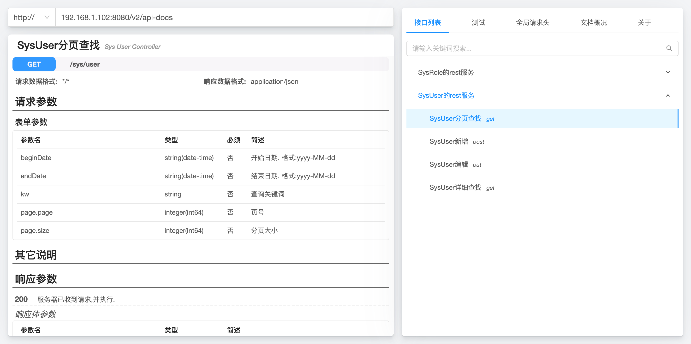
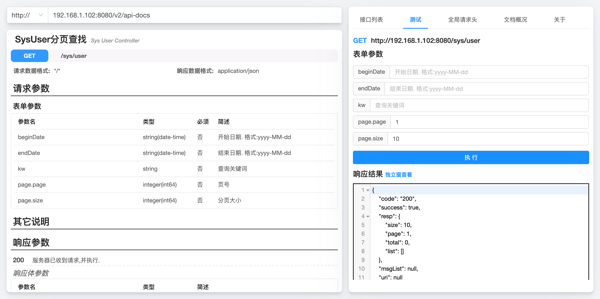
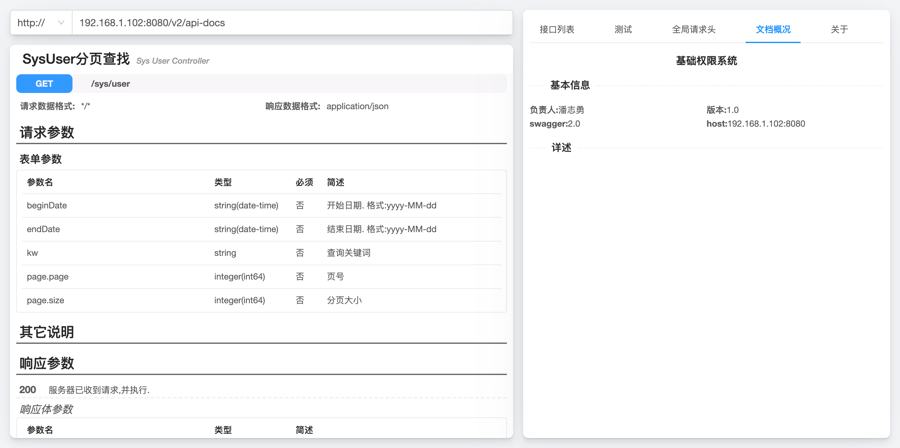

# winter-swagger-ui

## 作用

自定义的swagger主题. 更简洁, 更快速. 








## 前提

全局安装`umi 2.x`

`tyarn global add umi@2.13.3`

## 运行

```shell
# 安装依赖
tyarn install

# 运行
tyarn run serve
```

## 打包

```
tyarn run build
```

## 关于 chrome 浏览器插件

由于 `chrome` 浏览器的跨域限制越来越严格, 以及服务端可能并未开启跨域访问支持, 因此加入了 chrome 浏览器插件功能, 使其能够绕过跨域限制

## chrome浏览器如何引入 winter-swagger-ui 插件?

1. 执行打包`tyarn run build`, 此时会打包到dist目录
2. chrome打开插件管理界面, 启用开发者模式, 加入已解压的插件目录, 即第一步的dist目录
